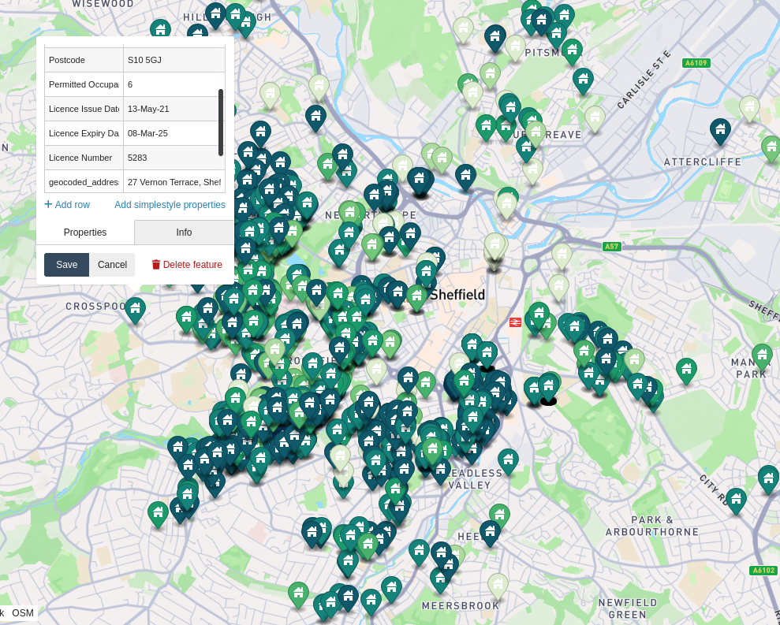

# HMO Licences in Sheffield

HMO licences from <https://www.sheffield.gov.uk/housing/houses-in-multiple-occupation> displayed on a map.

on geojson.io: <https://geojson.io/#data=data:text/x-url,https%3A%2F%2Fraw.githubusercontent.com%2Falifeee%2Fhmo-licences-in-sheffield%2Frefs%2Fheads%2Fmain%2Fhmos.geojson>

on Google Maps: <https://www.google.com/maps/d/u/0/edit?mid=1NjXfv4QNknNBu5NxOTnUoRictWhNfQM&usp=sharing>

see more maps on <https://alifeee.co.uk/maps/>



## Generate

the script takes around 10 minutes and should report an ETA when run

```bash
./geocode.sh <file.csv> <address cols format string> <postcode column>
# i.e., with format of hmo_licences_issued_to_9_september_2024.csv
./geocode.sh hmo_licences_issued_to_9_september_2024.csv "%2 %3 %1" 4
```

a `hmos.csv` file should now be available. there may be blank rows to be manually set, find them with:

```bash
file="hmos.csv"
while read num; do
  sed "${num}"'q;d' "${file}"
done <<< $(cat "${file}" | csvtool namedcol latitude - | awk '$0 ~ "null" {print NR}')
```

add some style information (from "Permitted Occupants" column)

```bash
# find min/max
csvtool namedcol "Permitted Occupants" hmo_licences_issued_to_9_september_2024.csv | sort -n | uniq -c
# make colour array
# e.g., with https://hihayk.github.io/scale/ or https://www.learnui.design/tools/data-color-picker.html
colors=(0A2F51 0F596B 16837A 1D9A6C 48B16D 74C67A ADDAA1 DEEDCF)

while read row; do
  occupants=$(echo "${row}" | csvtool col 5 -)
  index=$(($occupants - 4))
  [[ $index -lt 0 ]] && index=0
  [[ $index -ge "${#colors[@]}" ]] && index=$(( "${#colors[@]}" - 1 ))
  echo "home,#${colors[$index]}"
done <<< $(cat hmos.csv | awk 'NR>1') | sed '1s/^/marker-symbol,marker-color\n/' > /tmp/hmo_colors.csv
csvtool paste hmos.csv /tmp/hmo_colors.csv > /tmp/hmos.csv; mv /tmp/hmos.csv hmos.csv
```

to turn this into a geojson file, use <a href="https://github.com/pvernier/csv2geojson">https://github.com/pvernier/csv2geojson</a> with:

```bash
git clone git@github.com:pvernier/csv2geojson.git
(cd csv2geojson/; go build main.go)
./csv2geojson/main hmos.csv
```

make GPX by using an online tool like <https://products.aspose.app/gis/conversion/geojson-to-gpx>

## make google maps map

create a KML file by uploading `hmos.geojson` to <https://geojson.io/> and `Save > KML`

import it to Google Maps ([how?](https://www.google.com/maps/about/mymaps/)), view the data table, duplicate the "Permitted Occupants" column and change the type to `number`, and style by Permitted Occupants, range 10 (or otherwise).
